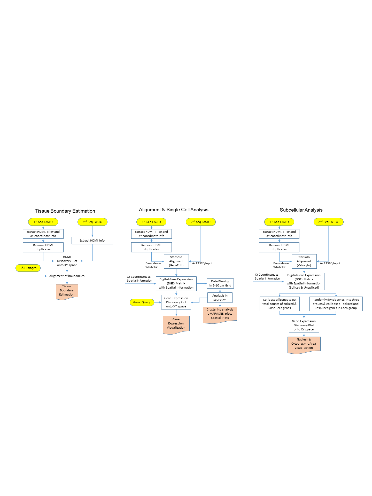

# Seq-Scope Data Analysis Pipeline

## Overview

Seq-Scope is a spatial barcoding technology with a resolution almost comparable to an optical microscope. Seq-Scope is based on a solid-phase amplification of randomly barcoded single-molecule oligonucleotides using an Illumina sequencing-by-synthesis platform. The resulting clusters annotated with spatial coordinates are processed to expose RNA-capture moiety. These RNA-capturing barcoded clusters define the pixels of Seq-Scope that are approximately 0.7-1 μm apart from each other. For more information, please refer to the link (put paper link here???).

This tutorial includes bash scripts that are used for preprocessing the data (tissue boundary detection, STARsolo alignment), and a R package "XXX" with functions to bin the data into square grids (not sure if we wanna do subcellular analysis). Bash script can be found  under BashScript folder in this repository. The R package "xxx" is still under active development.

## Getting Started
### Required Sofware Tools

You need to install the following software tools before using this pipeline. Linux operating system is necessary.
* STARSolo>=2.7.5c
* seqtk
* R 
* Python
* perl

### Example Data
The raw dataset used for Seq-Scope paper will be available in GEO and SRA, but in the meantime, please contact Jun Hee Lee (leeju@umich.edu) or Jingyue Xi (jyxi@umich.edu) regarding the access. The annoated file and H&E images can be found at https://doi.org/10.7302/cjfe-wa35. Here we assume that you already have access to these example dataset. 

* 1st-seq data (typically from MiSeq)
  - abc_SeqScope_1st.fastq.gz
* 2nd-seq data (typically from NovaSeq or HiSeq X)
  - abc_SeqScope_2nd_R1.fastq.gz
  - abc_SeqScope_2nd_R2.fastq.gz
* Reference sequence and STAR index ( include this??? )
  - mm10.fasta
  - mm10_ghi.gtf
  
### Install the packages (update)
To install the R pacakge "xxx", please run the following:
```
install.xxxxx
```


### Overall Workflow
This image shows the overall workflow for Seq-Scope data. We will introduce the implementations for each workflow section. 
<p>
    
</p>

### Tissue Boundary Estimation
In this section, we process 1st-seq data to extract spatial coordinates and match the HDMIs from 1st-seq to HDMIs from 2nd-seq and to visualize the tissue boundary captured by Seq-Scope compared to H&E images.  The bash script takes two file paths as arguments and outputs files in the current working directory. The tissueBoundaryPlot function visualize the tissue boundary.
#### Preprosessing
Firstly, we need to process our data with bash script extractCoord.sh, which can be found under script folder in this repository.

 * Input files:
  ```
  abc_SeqScope_1st.fastq.gz:  path of read file from 1st-Seq
  abc_SeqScope_2nd_R1.fastq.gz: path of read1 from 2nd-Seq
  hdmilength: An integer indicating the length of the HDMIs; For now, it can only take 20 or 30. In default, we assume if MiSeq is used for 1st-Seq, then hdmilenght=20; if HiSeq is used for 1st-Seq, then hdmilength=30.
  ```

 * Codes:
```
chmod +x extractCoord.sh
bash extractCoord.sh [abc_SeqScope_1st.fastq.gz] [abc_SeqScope_2nd_R1.fastq.gz] [20]
```
* Output:

```
spatialcoordinates.txt: Five columns representing 1st-Seq HDMIs, lane, tile, X, Y 
whitelists.txt: This is the whitelists of HDMIs used for STARsolo alignment. If MiSeq is used for 1st-Seq, then whitelists are the reverse complementary of HDMIs in bottom tiles from 1st-Seq ; if HiSeq is used for 1st-Seq,  whitelists are the reverse complementary of HDMIs in all tiles in lane 2 from 1st-Seq.
HDMI_SeqScope_2nd.txt
```
#### Discovery plot of tissue boundary

To Visualize the spatial map of HDMI barcode and estimate the tissue boundary, please run estimateTissueBoundary function within the shell. Please install the following python modules before running the script.
* Required python modules
  *  pands
  *  os
  *  sys
  *  numpy
  *  pandas
  *  os
  *  mpl_scatter_density
  *  matplotlib
  *  pylab
  *  sys
  

The script estimateTissueBoundary.py can be found under script folder in this repository. Please download the script in your working directory and run it within the shell.

* Input:
```
[pos1stSeq]:  txt file with spatial information from 1st-Seq. The txt file have five columns representing 1st-Seq HDMIs, lane, tile, X, Y. We can use spatialcoordinates.txt from extractCoord.sh
[hdmi2ndSeq]: txt file with HDMIs from the 2nd-Seq. We can use HDMI_SeqScope_2nd.txt from extractCoord.sh
[maxScale]: vmax value for the colorbar. If not known, just put "Null" as input.
[outpath]: path to output the plots
```
* Code
```
python estimateTissueBoundary.py [pos1stSeq] [hdmi2ndSeq] [maxScale] [outpath]
```
* Output
```
tile*.png: The discovery plot can be uesd to compare with H&E images
```


### STARsolo Alignment and Data Binning
In this subsection, we firstly preprocess the data and run alignment with reference genome using STARsolo. Then  the digital expression matrix(DGE) is binned into square grids with user defined options.

#### Alignment
This step is to preprocess the fastq files and to  align the data to reference genome.The bash script takes in several user defined parameters and outputs STARsolo summary statistics, and DGE in the current directory. Note: Here we assume you already have the reference genome that is needed for STARsolo alignment. If not please refer to https://hbctraining.github.io/Intro-to-rnaseq-hpc-O2/lessons/03_alignment.html 
* Input
```
abc_SeqScope_2nd_R1.fastq.gz: Read1 from 2nd-Seq 
abc_SeqScope_2nd_R2.fastq.gz: Read2 from 2nd-Seq
hdmilength: An integer indicating the length of the HDMIs; For now, it can only take 20 or 30. In default, we assume if MiSeq is used for 1st-Seq, then hdmilenght=20; if HiSeq is used for 1st-Seq, then hdmilength=30.
whitelists.txt: whitelists of barcodes from extractCoord.sh
outprefix: prefix for STARsolo output
starpath: path for STAR software
seqtkpath: path for seqtk tool
geneIndex: reference genome directory

```
* Code
```
chmod +x align.sh
bash align.sh [abc_SeqScope_2nd_R1.fastq.gz] [abc_SeqScope_2nd_R2.fastq.gz] [hdmilength] [whitelists.txt] [outprefix] [starpath] [seqtkpath] [geneIndex]
```
* Output
```
#The STARsolo output that is used for downstream analysis (such as data binning, clustering, cell type mapping)
prefixSolo.out/GeneFull/raw/matrix.mtx
prefixSolo.out/GeneFull/raw/barcodes.mtx
prefixSolo.out/GeneFull/raw/features.mtx

#The STARsolo output that is used for subcellular analysis 
prefixSolo.out/Velocyto/raw/matrix.mtx
prefixSolo.out/Velocyto/raw/barcodes.mtx
prefixSolo.out/Velocyto/raw/features.mtx
```
#### Data Binning
DGE(prefixSolo.out/GeneFull/raw/) from STARsolo are binned into square grids. In our paper, we tried simple square binning and sliding window binning. Simple square binning generate a super tile with the tiles that the users are insterested in. For sliding window binning, currently it is only available for sub-field of one tile. We would improve this and make updates in the near future.
##### Simple Square Binning
The function getSimpleGrid in the package '' collapsed HDMIs within a square grids with user-defined grid side length.
* Input
```
[seqscope1st]: "MiSeq" or "HiSeq"
[DGEdir]: directory path for DGE from STARsolo output that stores matrix.mtx,features.tsv,barcodes.tsv
[spatial]: txt file that stores spatial coordinates. This file is 'spatialcoordinates.txt' from  extractCoord.sh
[tiles]:a vector of tile numbers that the user is interested in
[nrow]: number of rows for super tile
[ncol]: number of columns for super tile
[sidesize]: side size of squre grids
[outpath]: output directory path


```
* Code
```
#This is an exmaple codes
DGEdir = '~/scrna/leejun/ngst/fastqs/HiSeq/ColonCombAll/analysis/align/ColonCombAll_Starsolo_trimA10_bottomSolo.out/Gene/raw'
spatial = '~/scrna/leejun/ngst/fastqs/MiSeq-DraI-100pM-mbcore-RD4-revHDMIs-pos-uniq.txt'
#colon: 
tiles = c(2103:2106,2110:2114,2118:2119)
nrow = 2
ncol=6
sidesize=300 #300units=10um
outpath = '/net/fantasia/home/jyxi/scrna/leejun/ngst/fastqs/HiSeq/ColonCombAll/analysis/Seurat/grid_10um_Gene/'
getCollapsedGrid('MiSeq',DGEdir,spatial,tiles,nrow,ncol,sidesize,outpath)
```
* Output
```
simpleSquareGrids.RDS
```
The simpleSquareGrids stores the count matrix, meta information and the spatial coordinates in images slot.
##### Sliding window binning(sub-field)
Sliding window grids are useful in doing cell type mapping. The function getSlidingGrid in the package '' collapsed HDMIs within a square grids with user-defined grid side length and a sliding window size. This version the sliding window function can be only ran on a small sub-field. We are currently working to improve the sliding window strategy and will update the package soon.

* Input
```
[seqscope1st]: "MiSeq" or "HiSeq"
[DGEdir]: directory path for DGE from STARsolo output that stores matrix.mtx,features.tsv,barcodes.tsv
[spatial]: txt file that stores spatial coordinates. This file is 'spatialcoordinates.txt' from  extractCoord.sh
[tiles]:a vector of tile numbers that the user is interested in
[nrow]: number of rows for super tile
[ncol]: number of columns for super tile
[sidesize]: side size of squre grids
[outpath]: output directory path
[window]: size of sliding window
[subXmin]: min value of X axis of the sub-field
[subXmax]: max value of X axis of the sub-field
[subYmin]: min value of Y axis of the sub-field
[subYmax]: max value of Y axis of the sub-field

```
* Code
```
```
* Output
```
slidingSquareGrids.RDS
```


After running these step,the final output files you will find most useful will be the following:
- DGE (matrix.mtx, barcodes.tsv, features.tsv) from STARsolo alignment under GeneFull and Velocyto folder
- simpleSquareGrids.RDS
- slidingSquareGrids.RDS

Downstream analysis(clustering,cell type mapping, etc) can be conducted using the three output files. Please refer to Seurat tutorials https://satijalab.org/seurat/archive/v3.2/spatial_vignette.html


### SubCellular Analysis


