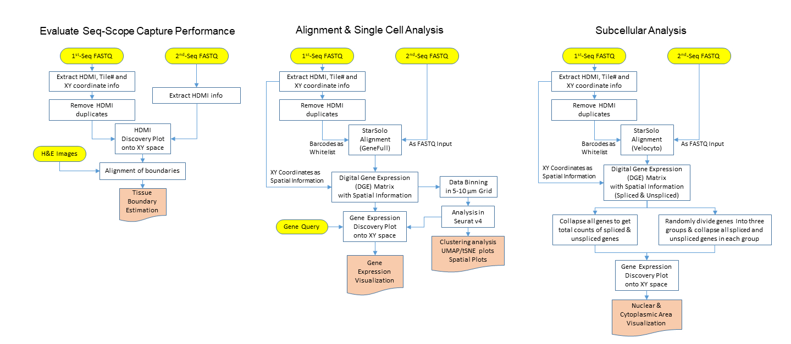

# Seq-Scope Data Analysis Pipeline

## Overview

Seq-Scope is a spatial barcoding technology with a resolution almost comparable to an optical microscope. Seq-Scope is based on a solid-phase amplification of randomly barcoded single-molecule oligonucleotides using an Illumina sequencing-by-synthesis platform. The resulting clusters annotated with spatial coordinates are processed to expose RNA-capture moiety. These RNA-capturing barcoded clusters define the pixels of Seq-Scope that are approximately 0.7-1 μm apart from each other. For more information, please refer to the link (put paper link here???).

This Github page includes the pipepline and codes for processing the data, including tissue boundary detection, alignment, and downstream analysis(gridding, collapsing, clustering analysis, etc.).

## Getting Started

### Required Sofware Tools

You need to install the following software tools before using this pipeline. Linux operating system is necessary.
* STARSolo>=2.7.5c
* seqtk
* R 
* Python
* perl

### Example Data
The dataset used for Seq-Scope paper will be available in GEO and SRA, but in the meantime, please contact Jun Hee Lee (leeju@umich.edu) or Jingyue Xi (jyxi@umich.edu) regarding the access. Here we assume that you already have access to these example dataset. 

* 1st-seq data (typically from MiSeq)
  - abc_SeqScope_1st_R1.fastq.gz
* 2nd-seq data (typically from NovaSeq or HiSeq X)
  - def_SeqScope_2nd_R1.fastq.gz
  - def_SeqScope_2nd_R2.fastq.gz
* Reference sequence and STAR index (Not sure I wanna include this )
  - mm10.fasta
  - mm10_ghi.gtf
  
### Install the packages (update)


### Overall Workflow
This image shows the overall workflow for Seq-Scope data. And the following illustrations will introduce the implementations for each workflow section. Bash scripts can be found in script folder in this repo. 
<p>
    
</p>

### Tissue Boundary Estimation
In this section, we process 1st-seq data to extract spatial coordinates and match the HDMIs from 1st-seq to HDMIs from 2nd-seq and to visualize the tissue boundary captured by Seq-Scope compared to H&E images.  The bash script takes two file paths as arguments and outputs files in the current working directory. The tissueBoundaryPlot function helps the visualization.

 * Input files:
  ```
  abc_SeqScope_1st.fastq.gz:  path of read file from 1st-Seq
  abc_SeqScope_2nd_R1.fastq.gz: path of read1 from 2nd-Seq
  ```

 * Codes:
```
bash extractCoord.sh [abc_SeqScope_1st.fastq.gz] [abc_SeqScope_2nd_R1.fastq.gz]
```
* Output:
```
spatialcoordinates.txt
whitelists.txt
HDMI_SeqScope_2nd.txt
```
To Visualize the spatial map of HDMI barcode,please run (update)
```
update this!
```


### STARsolo Alignment and Data Binning
In this subsection, we firstly preprocess the data and run alignment with reference genome using STARsolo. Then  the digital expression matrix(DGE) is binned into square grids with user defined side size.

#### Alignment
This step is to preprocess the fastq files and to  align the data to reference genome
* Input
```
abc_SeqScope_2nd_R1.fastq.gz: Read1 from SeqScope_2nd files
abc_SeqScope_2nd_R2.fastq.gz: Read2 from SeqScope_2nd files
whitelists.txt: whitelists of barcodes from output from previous section
outprefix: prefix for STARsolo output
starpath: path for STAR software
seqtkpath: path for seqtk tool
geneIndex: reference genome directory
```
* Code
```
bash align.sh [abc_SeqScope_2nd_R1.fastq.gz] [abc_SeqScope_2nd_R2.fastq.gz] [whitelists.txt] [outprefix] [starpath] [seqtkpath] [geneIndex]
```
* Output
```
#The most important ones from STARsolo output:
prefixSolo.out/GeneFull/matrix.mtx
prefixSolo.out/GeneFull/barcodes.mtx
prefixSolo.out/GeneFull/features.mtx
```
#### Data Binning
DGE from STARsolo are binned into square grids. In our paper, we tried simple square binning and sliding window binning. Currenly we can only run sliding window binning o a sub-field of the image. We would improve this and make updates in the near future 
##### Simple Square Binning
The function getSimpleGrid in the package '' collapsed HDMIs within a square grids with user-defined grid side length.
* Input
```
[seqscope1st]: "MiSeq" or "HiSeq"
[DGEdir]: directory path for DGE from STARsolo output that stores matrix.mtx,features.tsv,barcodes.tsv
[spatial]: txt file that stores spatial coordinates. This file is 'spatialcoordinates.txt' from  extractCoord.sh
[tiles]:a vector of tile numbers that the user is interested in
[nrow]: number of rows for super tile
[ncol]: number of columns for super tile
[sidesize]: side size of squre grids
[outpath]: output directory path


```
* Code
```
#This is an exmaple codes
DGEdir = '~/scrna/leejun/ngst/fastqs/HiSeq/ColonCombAll/analysis/align/ColonCombAll_Starsolo_trimA10_bottomSolo.out/Gene/raw'
spatial = '~/scrna/leejun/ngst/fastqs/MiSeq-DraI-100pM-mbcore-RD4-revHDMIs-pos-uniq.txt'
#colon: 
tiles = c(2103:2106,2110:2114,2118:2119)
nrow = 2
ncol=6
sidesize=300 #300units=10um
outpath = '/net/fantasia/home/jyxi/scrna/leejun/ngst/fastqs/HiSeq/ColonCombAll/analysis/Seurat/grid_10um_Gene/'
getCollapsedGrid('MiSeq',DGEdir,spatial,tiles,nrow,ncol,sidesize,outpath)
```
* Output
```
simpleSquareGrids.RDS
```
The simpleSquareGrids stores the count matrix, meta information and the spatial coordinates in images slot.
##### Sliding window binning(sub-field)
Sliding window grids are useful in doing cell type mapping. The function getSlidingGrid in the package '' collapsed HDMIs within a square grids with user-defined grid side length and a sliding window size. This version the sliding window function can be only ran on a small sub-field. We are currently working to improve the sliding window strategy and will update the package soon.

* Input
```
[seqscope1st]: "MiSeq" or "HiSeq"
[DGEdir]: directory path for DGE from STARsolo output that stores matrix.mtx,features.tsv,barcodes.tsv
[spatial]: txt file that stores spatial coordinates. This file is 'spatialcoordinates.txt' from  extractCoord.sh
[tiles]:a vector of tile numbers that the user is interested in
[nrow]: number of rows for super tile
[ncol]: number of columns for super tile
[sidesize]: side size of squre grids
[outpath]: output directory path
[window]: size of sliding window
[subXmin]: min value of X axis of the sub-field
[subXmax]: max value of X axis of the sub-field
[subYmin]: min value of Y axis of the sub-field
[subYmax]: max value of Y axis of the sub-field

```
* Code
```
```
* Output
```
slidingSquareGrids.RDS
```


After running these step,the final output files you will find most useful will be the following:
- DGE (matrix.mtx, barcodes.tsv, features.tsv) from STARsolo alignment
- simpleSquareGrids.RDS
- slidingSquareGrids.RDS

Downstream analysis(clustering,cell type mapping, etc) can be conducted using the three output files.


### SubCellular Analysis


